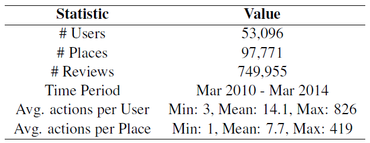
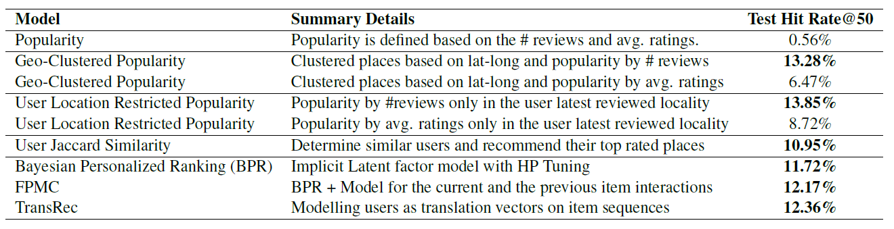

# Google Next Point of Interest Recommendations

Where should I explore next? An important question each one of us face where there are lot of different places and choices to explore. Systems that recommend next POI locations are very crucial in this scenario to help the user identify the right local businesses based on their location, preferences and business types. In this project, we developed different recommendation systems for Google Local next POI recommendations using various methods ranging from location based heuristics to sequential aware latent factor models.

## Data
The [Google Local](https://cseweb.ucsd.edu/~jmcauley/datasets.html#google_local) dataset contains user reviews of different local places, information about the places and certain information about the users themselves.

The information available in all the three datasets are:
• reviews: rating, review text, review time
• places: name, address, gps, phone
• user: userid, education, jobs, current place, previous places, username

The dataset is for the entire world and contains 11.4M reviews of 3.1M places given by 4.5M users. In this project, we focused on reviews and places
from USA.

The final statistics of the working dataset are:

## Results
The table summarizes the results for all the models ranging from popularity based, collaborative filtering and sequence aware latent factor models.

## Conclusion

* This dataset is highly driven by local popularity and geo-clustered and userlocal
popularity achieved a hit-rate of 13+%
* The popularity by number of reviews significantly outperformed the average ratings popularity
* TransRec slightly outperformed FPMC which beats BPR slighly because the former models incorporate the sequential aspect into their model which is very important for this dataset
* Jaccard similarity results are very close to the latent factor models